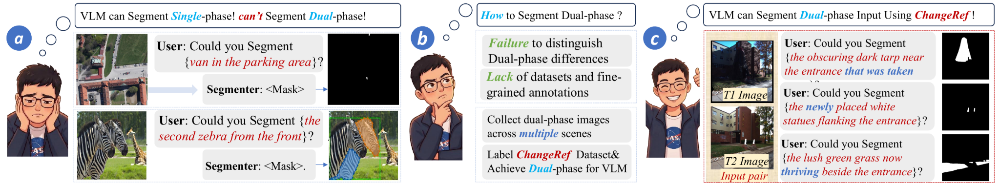
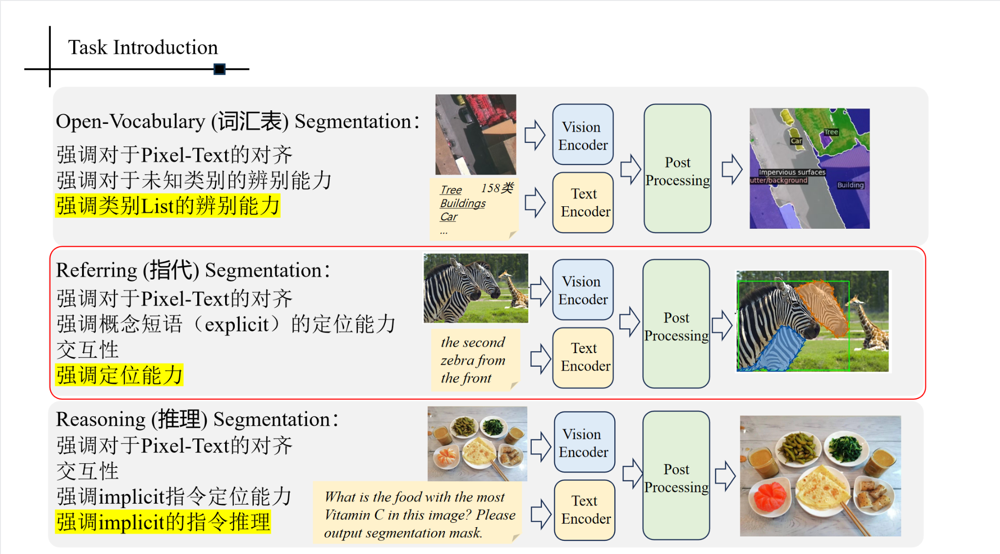
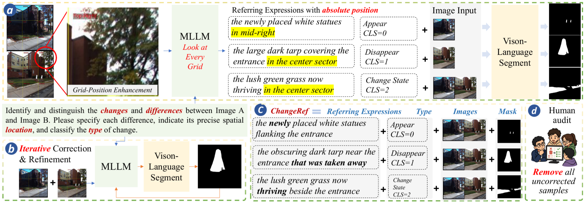
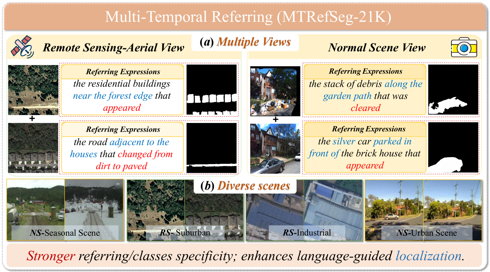
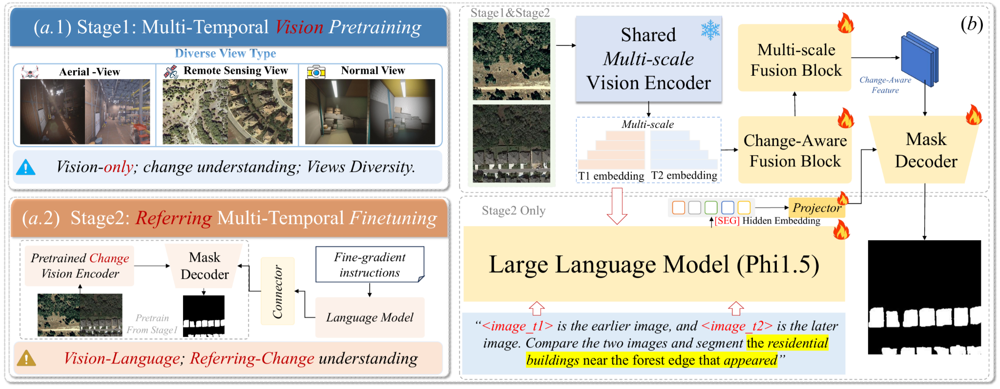
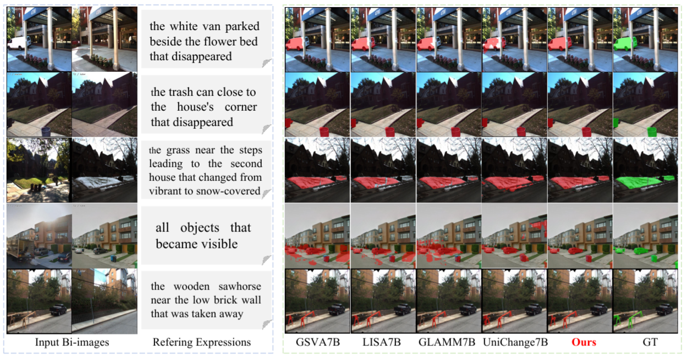
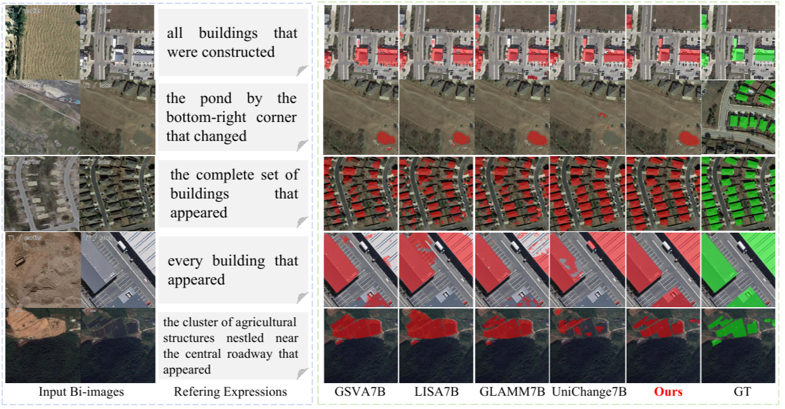

# MTRefSeg: An Open-Source Benchmark and Baseline for Multi-temporal Referring Segmentation

<div align="center">
  
</div>

MTRefSeg-R1 is a bi-temporal vision-language segmentation framework for **MTRefSeg**, where the model receives two temporal images (`T1`, `T2`) together with a natural-language instruction, and predicts the target changed region. This repository is built on the SegEarth-R1 codebase and extends it to **instruction-following change referring segmentation** across remote-sensing, aerial, and normal-scene views.

The current implementation focuses on:

- dual-time visual understanding instead of single-image segmentation
- fine-grained language grounding for changed objects, regions, and states
- a two-stage training recipe: multi-temporal visual pretraining, then language-guided fine-tuning
- analysis utilities for attention maps, qualitative masks, and ablation studies

## Task Overview

<div align="center">
  
</div>

Compared with open-vocabulary segmentation, referring segmentation, and reasoning segmentation, MTRefSeg emphasizes **temporal difference understanding**, **precise spatial grounding**, and **instruction-following change localization**. The model must not only recognize what changed, but also understand where the change happened and how that change is described in natural language.

## Dataset Construction

<div align="center">
  
</div>

The MTRefSeg data pipeline is designed to produce fine-grained change descriptions with:

- explicit change localization
- change-type labeling such as appear, disappear, and state change
- iterative refinement with multimodal assistance
- human audit to remove low-quality or incorrect samples

<div align="center">
  
</div>

The multi-temporal referring dataset covers multiple view types and diverse scenes, including remote-sensing / aerial views and normal scenes. In this repository, the cleaned training and validation data are organized under `MTRefSeg_Clear`, while stage-1 pretraining uses dedicated multi-temporal pretraining subsets.

## Method Overview

<div align="center">
  
</div>

MTRefSeg-R1 uses a two-stage pipeline:

- **Stage 1: Multi-Temporal Vision Pretraining**
  - trains the visual branch on bi-temporal change understanding
  - learns change-aware multi-scale features across aerial, remote-sensing, and normal-scene views
  - mainly updates the visual encoder, mask decoder, and temporal fusion modules
- **Stage 2: Referring Multi-Temporal Fine-Tuning**
  - injects language supervision for fine-grained change expressions
  - loads the stage-1 visual checkpoint by default
  - fine-tunes the full vision-language model for change referring segmentation

In the current implementation, the main components are:

- `Phi-1.5` as the language model
- `Mask2Former + Swin-Base` style visual backbone / mask decoder
- change-aware temporal fusion blocks
- a sparse projector that connects visual tokens and language reasoning

The default training recipe is **not LoRA-based**. The stage-1 and stage-2 scripts set `--lora_enable False` by default. LoRA is only used in dedicated ablation scripts.

## Repository Layout

```text
MTRefSeg-R1/
├── assets/                     # figures used in this README
├── checkpoint/                 # training outputs and checkpoints
├── logs/                       # training / evaluation / ablation logs
├── pretrained_weights/         # required base checkpoints
├── scripts/                    # training, evaluation, visualization, ablation entrypoints
├── attention_vis/              # saved attention-map visualizations
└── segearth_r1/                # core codebase
```

The most relevant directories are:

- `scripts/`: ready-to-run shell entrypoints
- `segearth_r1/train/`: stage-1 and stage-2 training code
- `segearth_r1/eval_and_test/`: evaluation datasets and inference code
- `assets/`: task, dataset, method, and qualitative figures

## Installation

The repository scripts assume a Python 3.10 environment. The training scripts in `scripts/` currently activate a conda environment named `segr1`, so either create that environment or update the scripts to match your own environment name.

Recommended setup:

```bash
conda create -n segr1 python=3.10
conda activate segr1

cd /lby_data01/zhaozy/lby/ChangeVLM-Other_MLLM_RCD/LVLM/MTRefSeg-R1

pip install torch==2.1.0 torchvision==0.16.0 torchaudio==2.1.0 --index-url https://download.pytorch.org/whl/cu121
pip install -r requirements.txt
```

Additional dependencies:

- install `detectron2` following the official instructions
- compile the CUDA kernel for `MSDeformAttn`

```bash
cd segearth_r1/model/mask_decoder/Mask2Former_Simplify/modeling/pixel_decoder/ops
sh make.sh
```

## Data Preparation

The training code supports two related data modes:

- `change_detection_stage1`: visual-only bi-temporal pretraining
- `change_detection`: full referring change segmentation

The expected split layout is:

```text
split_root/
├── A/
├── B/
├── masks/
└── referring_expression/
```

Each JSON file in `referring_expression/` should follow the format used by the training dataset:

```json
{
  "img_A": "filename_A.jpg",
  "img_B": "filename_B.jpg",
  "referring_expressions": [
    "the building near the forest edge that appeared"
  ]
}
```

The default data root used in the scripts is:

```bash
/lby_data01/zhaozy/lby/MTRefSeg_Clear
```

The main split conventions in this repository are:

- Stage 1 TV pretraining: `MTRefSeg_pretrain_TV_clean`
- Stage 1 NS pretraining: `MTRefSeg_pretrain_NS`
- Stage 1 RS pretraining: `MTRefSeg_pretrain_RS`
- Stage 2 TV train / val: `train_FINAL_CLEAN`, `val_FINAL_CLEAN`
- Stage 2 NS train / val: `NS_FINAL_CLEAN_train`, `NS_FINAL_CLEAN_val`
- Stage 2 RS train / val: `RS_FINAL_CLEAN_train`, `RS_FINAL_CLEAN_val`

## Required Pretrained Weights

Place the required base weights under:

```text
pretrained_weights/
├── phi-1_5_dev/
└── model_final_9d7f02.pkl
```

Required weights:

- `pretrained_weights/phi-1_5_dev`
  - Phi-1.5 base language model
- `pretrained_weights/model_final_9d7f02.pkl`
  - Mask2Former / Swin-Base visual checkpoint

## Training

### Full Two-Stage Pipeline

For the standard TV setting:

```bash
bash scripts/run_stage1_stage2_TV.sh
```

For the RS setting:

```bash
bash scripts/run_stage1_stage2_RS.sh
```

For the NS setting:

```bash
bash scripts/run_stage1_stage2_NS.sh
```

Notes:

- `run_stage1_stage2_TV.sh` runs both stage 1 and stage 2
- `run_stage1_stage2_RS.sh` runs both stage 1 and stage 2
- `run_stage1_stage2_NS.sh` currently assumes the stage-1 checkpoint already exists; the stage-1 call is commented out in the wrapper script
- the TV wrapper defaults to `MTRefSeg_pretrain_TV`, while `run_stage1_visual_pretrain_TV.sh` defaults to `MTRefSeg_pretrain_TV_clean`; pass the data path explicitly if your local folder uses the `_clean` suffix

To run all three main pipelines and then launch ablations:

```bash
bash scripts/run_all.sh
```

### Stage 1 Only: Visual Change Pretraining

TV:

```bash
bash scripts/run_stage1_visual_pretrain_TV.sh
```

NS:

```bash
bash scripts/run_stage1_visual_pretrain_NS.sh
```

RS:

```bash
bash scripts/run_stage1_visual_pretrain_RS.sh
```

The stage-1 scripts train with:

- `dataset_type=change_detection_stage1`
- `lora_enable=False`
- `temporal_fusion_type=change_aware`

Typical outputs:

- `checkpoint/stage1_visual_change_pretrain_TV`
- `checkpoint/stage1_visual_change_pretrain_NS`
- `checkpoint/stage1_visual_change_pretrain_RS`

### Stage 2 Only: Referring Multi-Temporal Fine-Tuning

TV:

```bash
bash scripts/run_stage2_full_finetune_TV.sh
```

NS:

```bash
bash scripts/run_stage2_full_finetune_NS.sh
```

RS:

```bash
bash scripts/run_stage2_full_finetune_RS.sh
```

The default stage-2 recipe:

- uses `dataset_type=change_detection`
- loads the stage-1 visual checkpoint through `--stage1_pretrained_path`
- uses `lora_enable=False`
- fine-tunes the model in the `checkpoint/` directory

### End-to-End MLLM Pretraining

If you want to pretrain the full vision-language model directly without stage-1 visual-only pretraining:

```bash
bash scripts/run_e2e_mllm_pretrain.sh
```

## Saving Checkpoints

The default training recipe does **not** require any additional weight-merging step.

Checkpoint behavior:

- stage-1 and stage-2 runs are saved directly under `checkpoint/<run_name>/`
- Hugging Face Trainer / DeepSpeed checkpoints are typically stored as `checkpoint-*` directories
- the stage-2 wrapper scripts automatically resolve the latest `checkpoint-*` directory when a parent output directory is provided

Typical save locations:

- `checkpoint/stage1_visual_change_pretrain_TV`
- `checkpoint/stage1_visual_change_pretrain_NS`
- `checkpoint/stage1_visual_change_pretrain_RS`
- `checkpoint/stage2_train_final_val`
- `checkpoint/stage2_ns_final`
- `checkpoint/stage2_rs_final`

If you train with the default scripts, those saved directories are already the expected inputs for later evaluation or further fine-tuning.

## Evaluation

Use the provided evaluation wrapper:

```bash
bash scripts/eval_change.sh [MODEL_PATH] [DATA_PATH] [SPLIT] [GPU_IDS] [VIS_PATH]
```

Examples:

TV validation:

```bash
bash scripts/eval_change.sh \
  ./checkpoint/stage2_train_final_val \
  /lby_data01/zhaozy/lby/MTRefSeg_Clear \
  val \
  0
```

NS validation:

```bash
bash scripts/eval_change.sh \
  ./checkpoint/stage2_ns_final \
  /lby_data01/zhaozy/lby/MTRefSeg_Clear/NS_FINAL_CLEAN_val \
  val \
  0
```

RS validation:

```bash
bash scripts/eval_change.sh \
  ./checkpoint/stage2_rs_final \
  /lby_data01/zhaozy/lby/MTRefSeg_Clear/RS_FINAL_CLEAN_val \
  val \
  0
```

Evaluation notes:

- `DATA_PATH` can be either the dataset root containing split subdirectories, or a concrete split directory containing `A/`, `B/`, `masks/`, and `referring_expression/`
- `MODEL_PATH` can be a model directory or a concrete `checkpoint-*` directory
- pass `VIS_PATH` if you also want evaluation-time visualizations saved to disk

## Reproducing Paper Results

To reproduce the main paper results in this repository, use the three final stage-2 checkpoints below:

| Setting | Checkpoint | Eval split |
| --- | --- | --- |
| TV (train/val) | `checkpoint/stage2_train_final_val` | `val_FINAL_CLEAN` |
| NS | `checkpoint/stage2_ns_final` | `NS_FINAL_CLEAN_val` |
| RS | `checkpoint/stage2_rs_final` | `RS_FINAL_CLEAN_val` |

All commands below assume the dataset root is:

```bash
/lby_data01/zhaozy/lby/MTRefSeg_Clear
```

and that you want to evaluate with 4 GPUs (`0,1,2,3`). If your machine uses different GPU ids, replace `0,1,2,3` accordingly.

### TV Result

```bash
bash scripts/eval_change.sh \
  "checkpoint/stage2_train_final_val" \
  "/lby_data01/zhaozy/lby/MTRefSeg_Clear" \
  "val_FINAL_CLEAN" \
  "0,1,2,3" \
  2>&1 | tee logs/stage2_train_final_val.log
```

### NS Result

```bash
bash scripts/eval_change.sh \
  "checkpoint/stage2_ns_final" \
  "/lby_data01/zhaozy/lby/MTRefSeg_Clear" \
  "NS_FINAL_CLEAN_val" \
  "0,1,2,3" \
  2>&1 | tee logs/stage2_full_finetune_ns_final.log
```

### RS Result

```bash
bash scripts/eval_change.sh \
  "checkpoint/stage2_rs_final" \
  "/lby_data01/zhaozy/lby/MTRefSeg_Clear" \
  "RS_FINAL_CLEAN_val" \
  "0,1,2,3" \
  2>&1 | tee logs/stage2_full_finetune_rs_final.log
```

### Notes

- These three checkpoint directories are the final stage-2 models intended for reproducing the main paper numbers.
- The logs are written to:
  - `logs/stage2_train_final_val.log`
  - `logs/stage2_full_finetune_ns_final.log`
  - `logs/stage2_full_finetune_rs_final.log`
- If you only want a quick sanity check on one GPU, change the last GPU argument from `0,1,2,3` to a single id such as `0`.
- `scripts/eval_change.sh` accepts the dataset root plus split name, so you do not need to manually point it to `A/`, `B/`, `masks/`, and `referring_expression/`.

## Visualization and Analysis Utilities

### Attention Maps

This repository includes batched multi-layer attention visualization for bi-temporal reasoning:

```bash
bash scripts/visualize_mt_attn.sh
```

The default script:

- runs in batch mode
- samples multiple examples
- visualizes multiple layers such as `first,2,4,6,8,10,mid,last`
- saves outputs under `attention_vis/`

### Segmentation Map Visualization

To generate qualitative segmentation canvases:

```bash
bash scripts/visualize_segmap.sh
```

This script saves outputs under:

```text
../vis_segmap/MTRefSeg-R1
```

### Qualitative Results

Normal-scene qualitative comparison:

<div align="center">
  
</div>

Remote-sensing qualitative comparison:

<div align="center">
  
</div>

## Ablation Scripts

The repository also includes ready-to-run ablation entrypoints:

- `scripts/run_ablation_all.sh`
- `scripts/run_ablation_all2.sh`
- `scripts/run_ablation_fusion_sweep.sh`
- `scripts/run_ablation_lora_sweep.sh`
- `scripts/run_ablation_no_pretrain.sh`
- `scripts/run_ablation_e2e_mllm.sh`

Related summaries are typically written under:

- `logs/ablation/`

These scripts are useful for studying:

- temporal fusion variants
- LoRA vs. full fine-tuning
- end-to-end MLLM pretraining
- the effect of removing stage-1 visual pretraining

## Practical Notes

- the scripts in `scripts/` activate a conda environment named `segr1`; adjust that if your environment name differs
- the default temporal fusion mode is `change_aware`
- the default training recipe is full fine-tuning without LoRA
- if you already have a trained stage-1 checkpoint directory, you can pass the directory directly to the stage-2 wrapper scripts
- if you change data locations, update the hardcoded paths at the top of the shell scripts before launching training

## Acknowledgement

This repository inherits substantial engineering structure from:

- SegEarth-R1
- PSALM
- Mask2Former

Their open-source releases make this change-referring extension possible.
